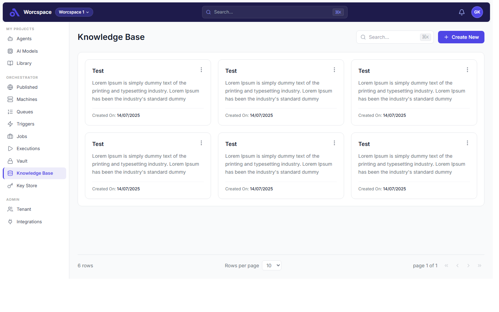
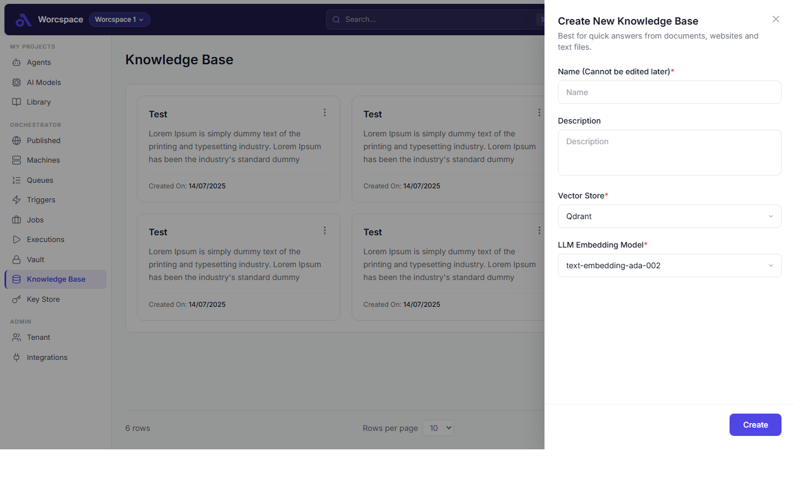

# Knowledge Base App — Aventisia Frontend Assignment

A pixel-accurate React implementation of the Knowledge Base UI, built as part of the Aventisia Junior Developer hiring assignment.

---

## Screenshots

### Screen 1 — Home Screen (Knowledge Base)



### Screen 2 — Create New Knowledge Base (Modal)



---

## Tech Stack

| Layer | Technology |
|---|---|
| Framework | React 19 (functional components + hooks) |
| Build Tool | Vite 8 |
| Styling | Tailwind CSS 3 |
| Icons | Lucide React |
| Language | JavaScript (ES2022+) |

**Primary color:** `#4F46E5`
**Secondary color:** `#1E1B4B`

---

## Features Implemented

- **Knowledge Base grid** — card layout with name, description, vector store, and creation date
- **Search** — live filtering by name with `⌘K` / `Ctrl+K` keyboard shortcut to focus the search input
- **Pagination** — rows-per-page selector and page navigation
- **Create New modal** — form with Name, Description, Vector Store, and AI Embedding Model fields
- **Sidebar navigation** — active-state highlighting, click-to-switch tabs; non-Knowledge-Base tabs render an empty state
- **Empty state** — displayed when a sidebar tab has no data
- **Responsive header** — workspace selector, global search bar, and user avatar

---

## Project Structure

```
src/
├── components/
│   ├── Header/
│   │   └── Header.jsx              # Top navigation bar
│   ├── Sidebar/
│   │   ├── Sidebar.jsx             # Sidebar with grouped nav sections
│   │   ├── SidebarItem.jsx         # Individual nav item with active state
│   │   └── SidebarSection.jsx      # Section wrapper with label
│   ├── KnowledgeBase/
│   │   ├── ContentHeader.jsx       # Page title + search + create button
│   │   ├── KnowledgeBaseGrid.jsx   # Responsive card grid
│   │   ├── KnowledgeBaseCard.jsx   # Individual knowledge base card
│   │   └── Pagination.jsx          # Page controls
│   ├── Modal/
│   │   └── CreateKnowledgeBaseModal.jsx
│   └── EmptyContainer/
│       └── EmptyContainer.jsx      # Empty state for inactive tabs
├── data/
│   └── knowledgeBases.js           # Mock data
├── App.jsx
└── main.jsx
```

---

## Getting Started

### Prerequisites

- Node.js 18+
- npm 9+

### Install & Run

```bash
# Clone the repository
git clone <repo-url>
cd knowledge-base-app

# Install dependencies
npm install

# Start development server
npm run dev
```

Open [http://localhost:5173](http://localhost:5173) in your browser.

### Build for Production

```bash
npm run build
npm run preview
```

---

## Interactions

| Action | Behavior |
|---|---|
| Click **Create New** | Opens the modal form |
| Click **Create** in modal | Closes the modal |
| Click outside modal / × | Dismisses the modal |
| Type in Search | Filters cards in real time |
| Press `⌘K` / `Ctrl+K` | Focuses the search input |
| Click any sidebar item | Switches active tab |
| Click non-KB sidebar item | Shows empty state with tab label |

---

*Submitted by: [Your Name] — Aventisia Junior Developer Assignment, April 2026*
